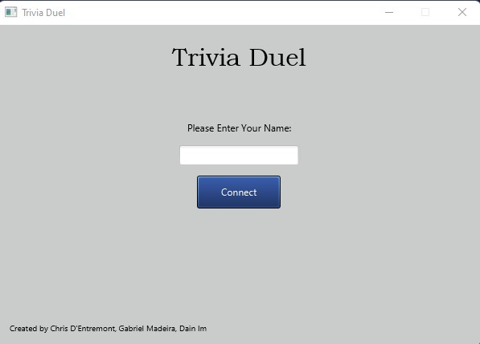
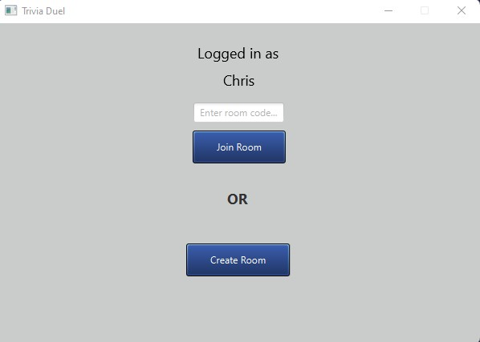
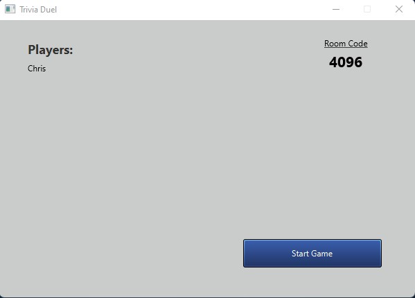
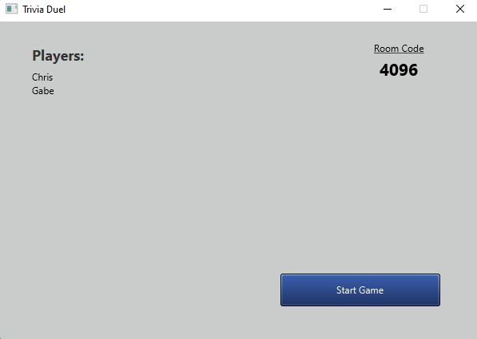
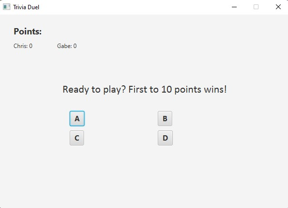

# Trivia Duel
## SERVER IS CURRENTLY OFFLINE. Game will not operate with online functionality, please view game functionality through screenshots below.
## Introduction
Trivia Duel is an online multiplayer game in which players correctly answer more questions than each other. We created this application to demonstrate the skills that we learned in our Network Programming course through socket programming.

## Game Features
- Create individual game rooms and invite other players to join with a given **room code**.
- Once game is started by room leader (player to create room), answer questions and get points. (First player to 10 points wins game.)
- If multiple players win the game (reach 10 points), all corresponding players' names will be presented in the winning result.

## Installation
### Download
- [Download the game here.](https://drive.google.com/file/d/14Q7-iGnI1CgHdzD6mYbYxQhUGjpWvG85/view?usp=sharing)
### Run
- Unzip **TriviaDuel.zip**, and run **TriviaDuel.exe**
- You may encounter the error: **This application requires a Java Runtime Environment 1.8.0.** You can download this runtime [here.](https://www.oracle.com/java/technologies/javase-jre8-downloads.html)

## Demonstration w/ Screenshots
The main menu where players can input their name and connect to server.

Once a player is logged in, they can either create a new lobby or join an existing lobby with a code.

Once a player is in a lobby, a code is displayed that will allow other players to join the same lobby. Once all players are ready, the player who made the lobby can press the button to begin the game.

Once the game is started, each players' score is kept track of at the top of the screen as the game progresses. The players are asked random questions and must choose their answers from the 4 provided.

## Contributors
- Chris D'Entremont - Frontend Developer
- Gabriel Madeira - JavaFX Designer
- Dain Im - Backend Developer
